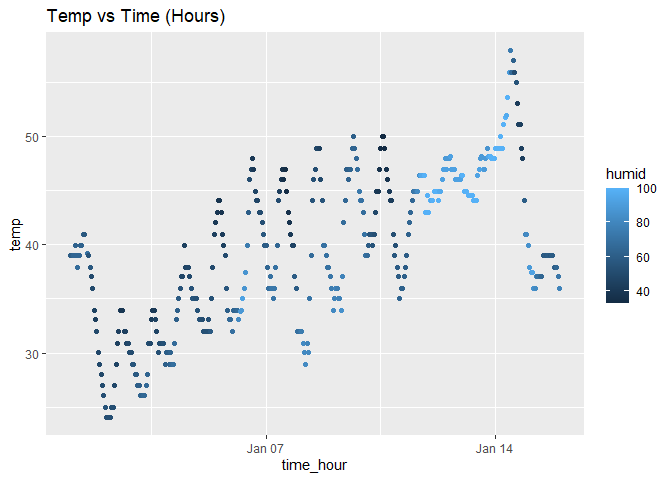

p8105_hw1_sjk2254
================
Sharon Kulali
2023-09-18

# Problem 1

loading the needed packages

assessing the dataset help file

``` r
?early_january_weather
```

    ## starting httpd help server ... done

``` r
nrow(early_january_weather)
```

    ## [1] 358

``` r
ncol(early_january_weather)
```

    ## [1] 15

Information about the dataset: The s\`\`

extracting the needed data drom table

``` r
temp = early_january_weather$temp
time_hour = early_january_weather$time_hour
```

creating the scatterplot

``` r
ggplot(data = early_january_weather, aes(x = time_hour, y = temp, color = humid)) +
  geom_point() + ggtitle("Temp vs Time (Hours)")
```

<!-- -->

saving the scatterplot

``` r
ggsave("scatter_plot_p1.pdf", height = 4, width = 6)
```
