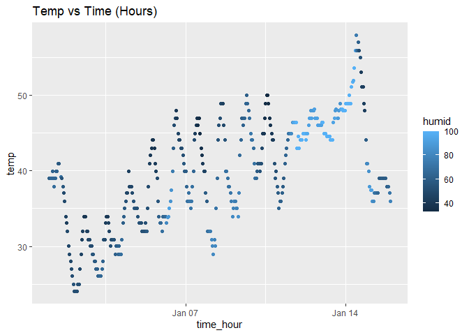

p8105_hw1_sjk2254
================
Sharon Kulali
2023-09-18

# Problem 1

``` r
# loading the needed packages

library(moderndive)
library(tidyverse)

# loading the needed data

data(early_january_weather)
```

``` r
# assessing the data set

?early_january_weather
```

This dataset `early_january_weather` shows the hourly meteorological
data for LGA, JFK, and EWR from January 2013. There are 358 rows
representing the hourly measurements and 15 columns representing the
variables which include `origin`, `year`, `month`, `day`, `hour`,
`temp`, `dewp`, `humid`, `wind_dir`, `wind_speed`, `wind_gust`,
`precip`, `pressure`, `visib`, and `time_hour`. Overall, the median
precipitation found was 0 inches with a mean temperature of 39.5821229
degrees Fahrenheit, and wind spreeds up to 24.16638 mph. Notably, the
wind gust variable had 308 missing values.

``` r
# creating the scatterplot

ggplot(data = early_january_weather, aes(x = time_hour, y = temp, color = humid)) +
  geom_point() + ggtitle("Temp vs Time (Hours)")
```

<!-- -->

This scatterplot generally represents a weak, positive pattern. There
appears to be a constant fluctuation from increase to decrease in
temperature throughout the month but on the broader scale, you can
observe that as the days progress, the temperatures continue to rise
hence showing a positive relationship. Additionally, the darker shade of
blue represents less humidity while the lighter shade of blue represents
more humidity.

``` r
# saving the scatterplot

ggsave("scatter_plot_p1.pdf", height = 4, width = 6)
```

# Problem \#2

``` r
# creating a data frame

p2_df = tibble(
     num_samp = rnorm(10),
     log_vec = num_samp > 0,
     chr_vec = c("female","female","unisex","unisex","male","male","female","male","unisex","female"),
     fct_vec = factor(chr_vec)
)
```

``` r
# computing the means

m_num_samp = mean(pull(p2_df, num_samp))
m_log_vec = mean(pull(p2_df, log_vec))
m_chr_vec = mean(pull(p2_df, chr_vec))
```

    ## Warning in mean.default(pull(p2_df, chr_vec)): argument is not numeric or
    ## logical: returning NA

``` r
m_fct_vec = mean(pull(p2_df, fct_vec))
```

    ## Warning in mean.default(pull(p2_df, fct_vec)): argument is not numeric or
    ## logical: returning NA

When computing the means, it works for the sample (numeric) variable and
the logical vector but not the character and factor vectors.

``` r
# converting the variables to be numeric

an_log_vec = as.numeric(pull(p2_df,log_vec))
mean(an_log_vec)

an_chr_vec = as.numeric(pull(p2_df,chr_vec))
mean(an_chr_vec)

an_fct_vec = as.numeric(pull(p2_df,fct_vec))
mean(an_fct_vec)
```

When converting the variables to be numeric, it changes their
classification types to be “numeric” instead of their previous classes
of “logical”, “character”, or “factor”. This happens because initially,
R automatically classified the objects based on the inputs but now it is
being clearly stated as a specific type. This explains what happens when
we try to take the mean because it can only be performed on a numeric
type data. More specifically, depending on how the data are stored. For
example, when we change the factor vector to a numeric class, we are
able to perform the mean because factors are stored as integers. On the
other hand, even though we changed the character vector into a numeric
class, we still cannot perform the mean because NAs are produced as a
result.
